<h2>This repo contains the basic ReactJS projects for beginners.</h2>

As a beginner, ReactJS project development may seem challenging, but one can simplify the whole process by breaking down an application into smaller components.

<h3>List of Projects</h3>
<ul>
<li>
Build a SPA(single-page application) in React.

<b>Project Glimpse</b>

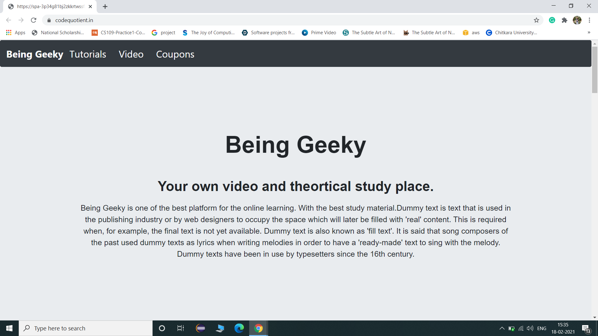
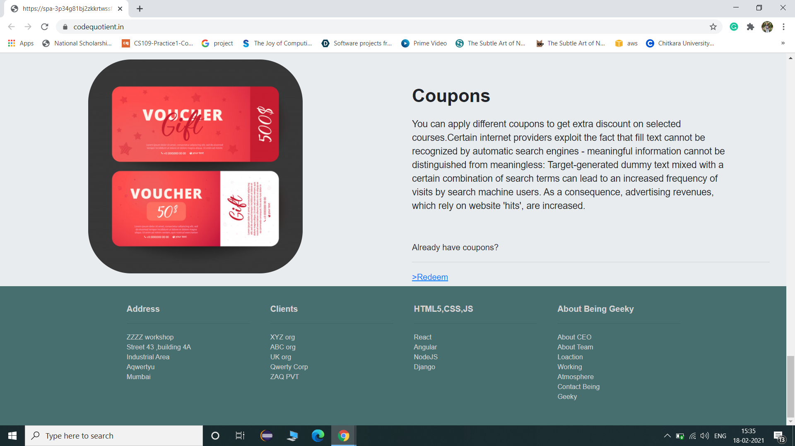

</li>
<li>
Build a Search app using React.

<b>Project Glimpse</b>

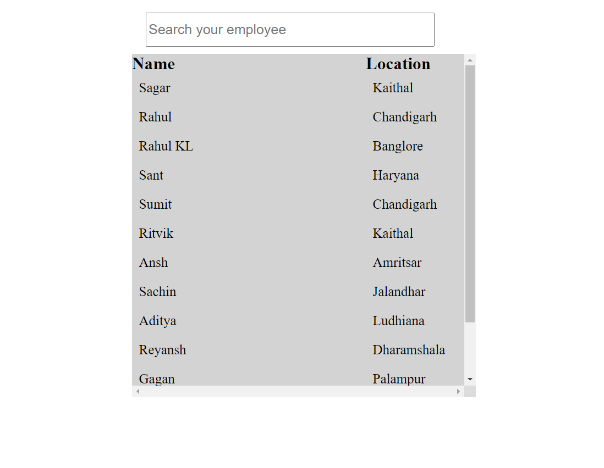
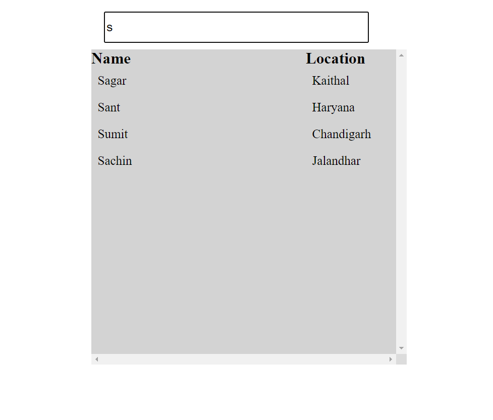

 
</li>
<li>
Build a route based app.

<b>Project Glimpse</b>

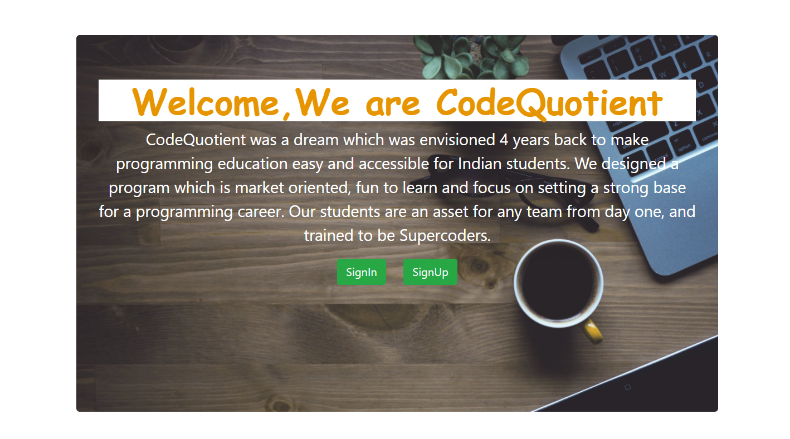
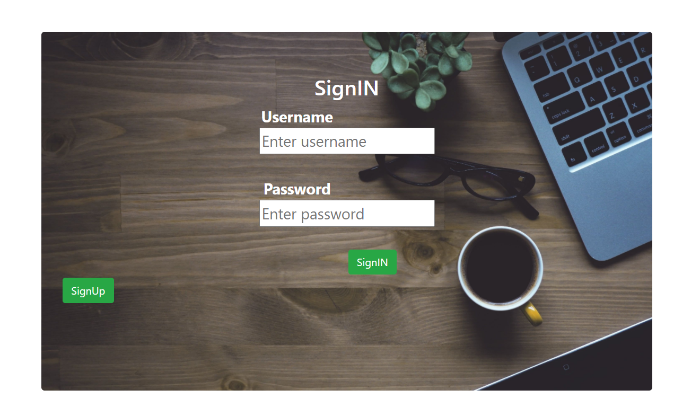
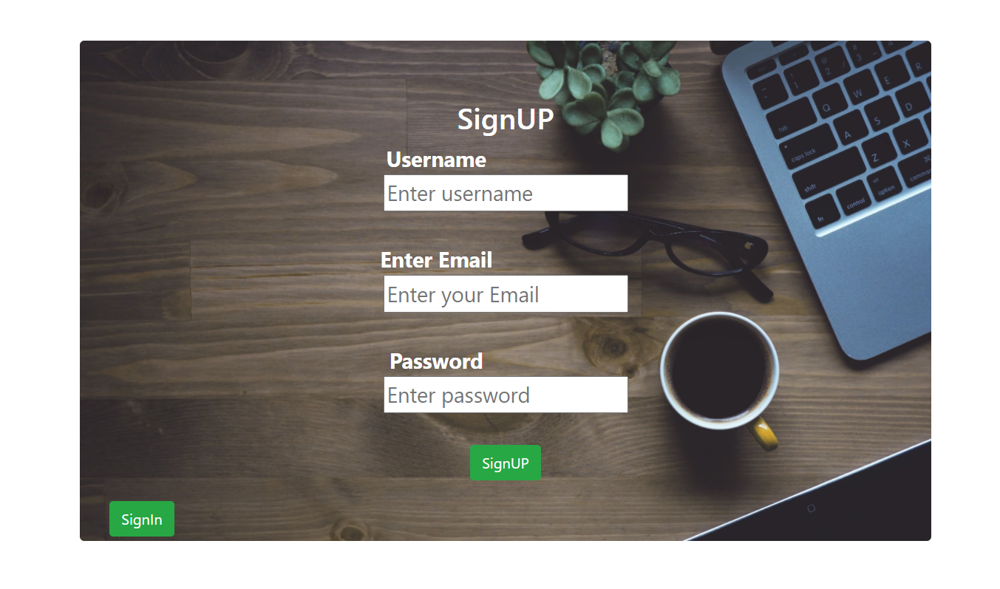
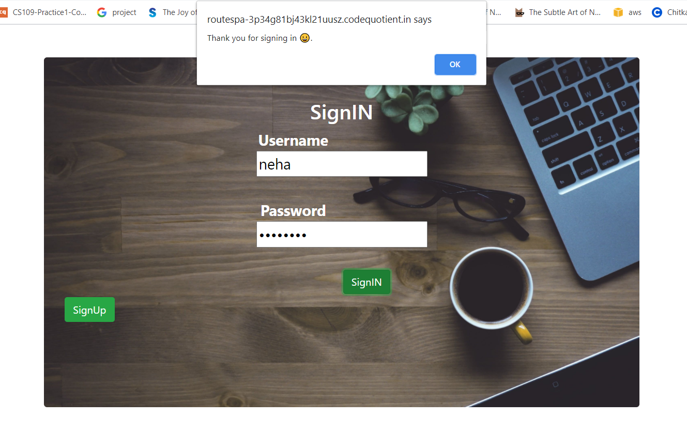

 
</li>
  <li>
Build a simple Calculator using ReactJS.

<b>Project Glimpse</b>

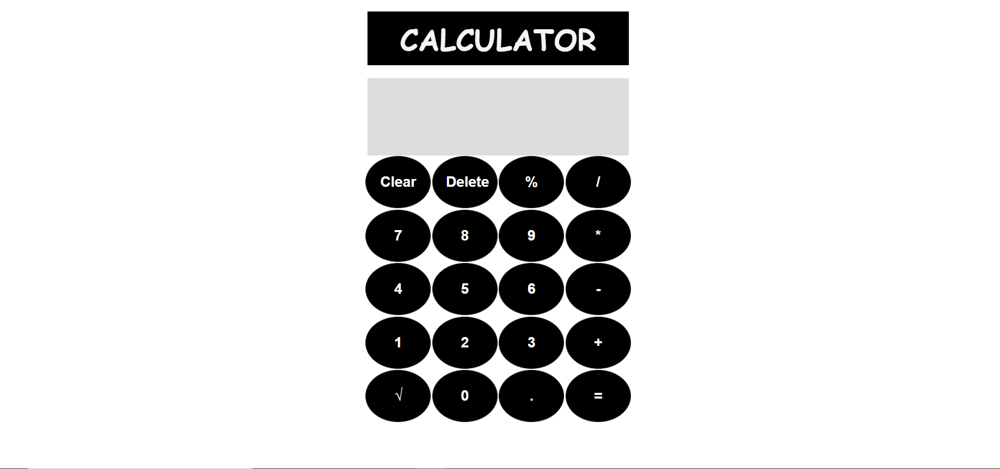
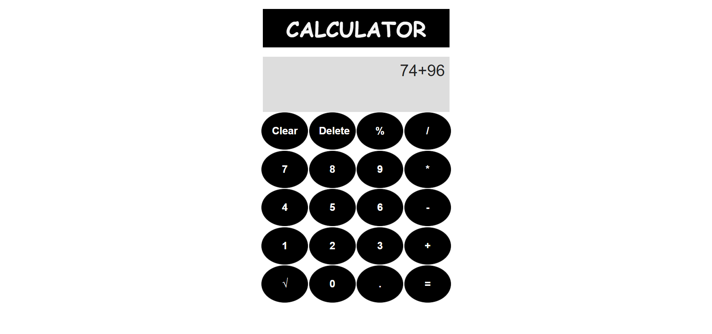
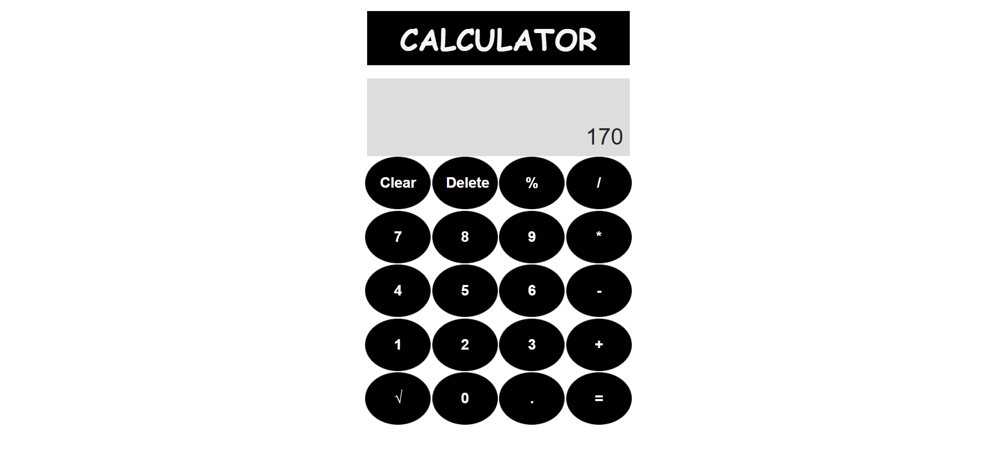

 
</li>

  <li>
Build a Currency Convertor using ReactJS.

<b>Project Glimpse</b>

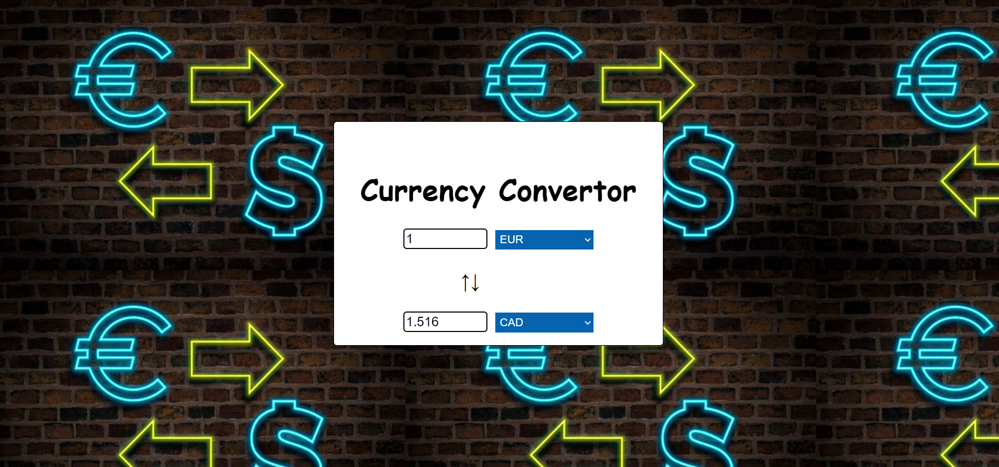
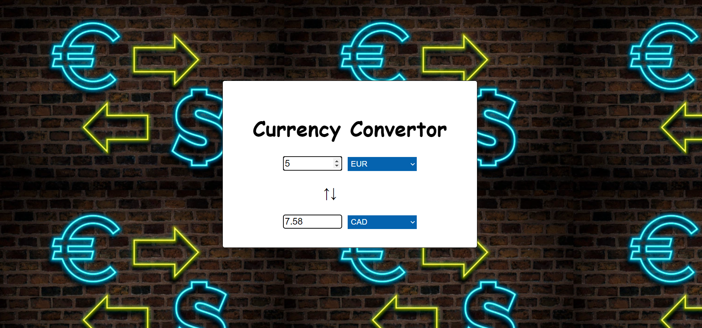

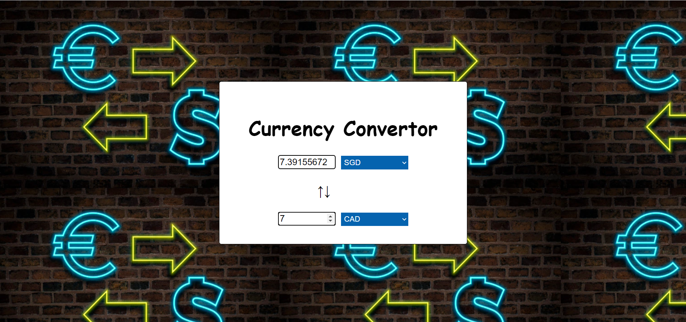

 
</li>

  <li>
Build a simple login application using React router

<b>Project Glimpse</b>

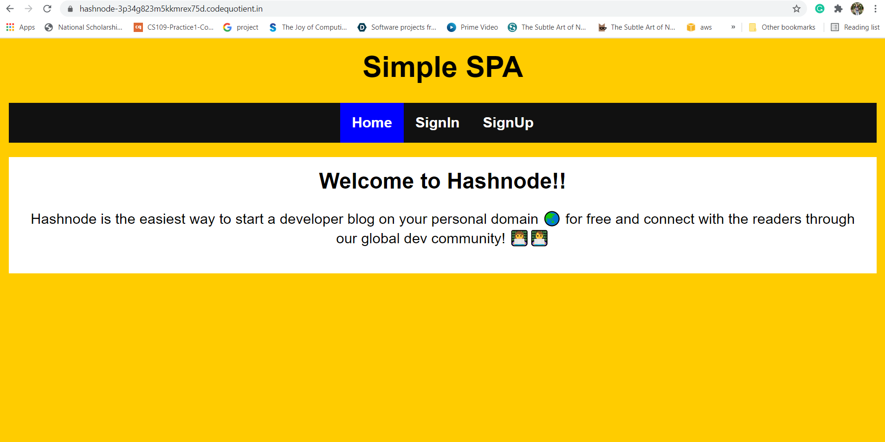
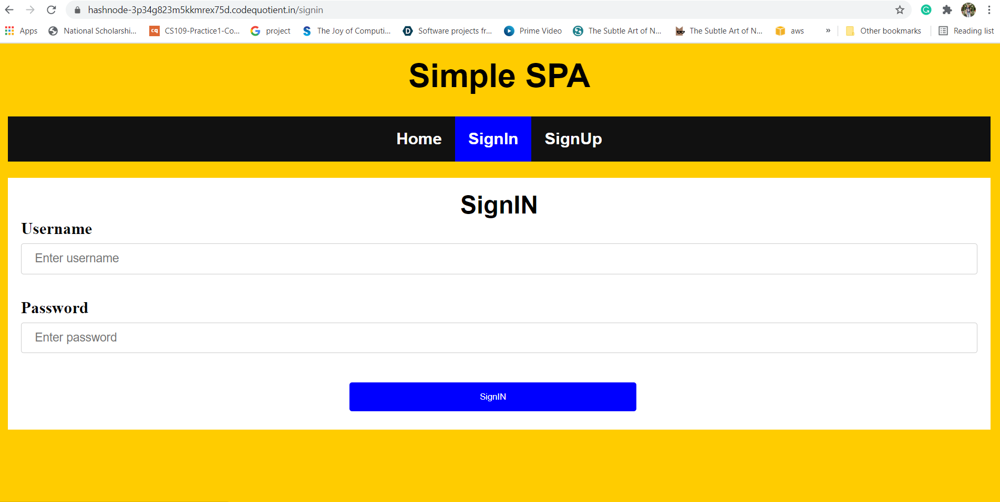
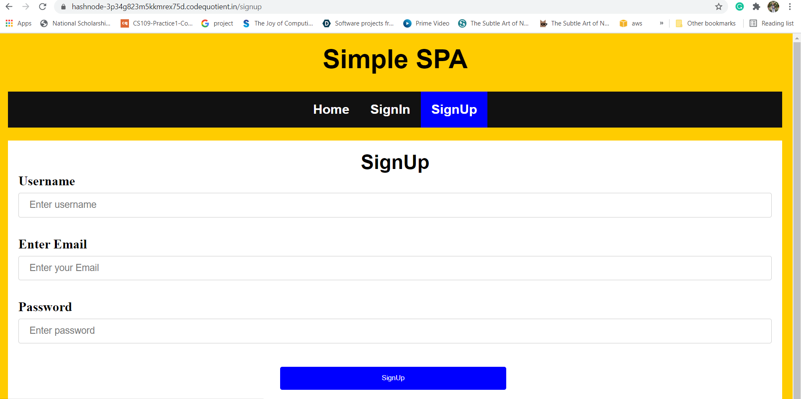

 
</li>
</ul>

<h3>Show some ❤ and ⭐ the repo if you find it useful. </h3>
<b>Note:-</b>
I will keep adding projects to this Repository.
